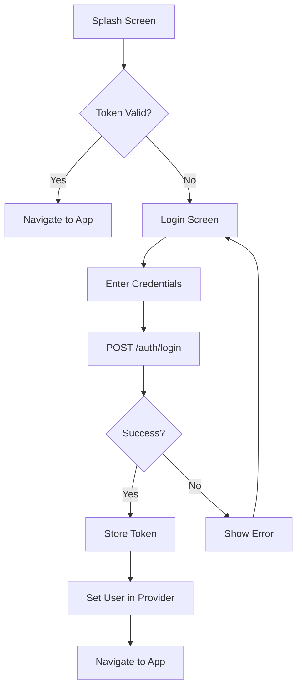

# Frontend Authentication API Integration Summary

## Overview
Successfully wired up the frontend authentication flow to match the Azaman backend API contract. The integration focuses on core authentication and routing logic with a scalable foundation for marketplace features.

## Changes Made

### 1. Created API Client Utility (`lib/services/api_client.dart`)
- **Purpose**: Centralized HTTP request handling with consistent error management
- **Features**:
  - Automatic JWT token injection via `Authorization: Bearer <token>` header
  - Development mode with mock responses for `/auth/login`, `/auth/me/:id`, and `/auth/settings/rates`
  - Comprehensive error handling with `ApiException` class
  - Secure storage integration for token management
- **Endpoints Supported**: GET, POST, PUT, multipart (file uploads)

### 2. Updated AuthProvider (`lib/providers/auth_provider.dart`)

#### Added Features:
- **JWT Validation**: `checkAuthStatus()` method validates tokens with backend before navigation
- **User Details Fetching**: `fetchUserDetails()` method retrieves current user data from `/auth/me/:id`
- **Enhanced State Management**: Added `isLoading` and `error` states for better UX
- **Auto-Clearing**: Automatic auth data clearing on 401 (unauthorized) responses

#### Updates:
- **setUser()**: Now includes token validation and FCM sync triggered automatically
- **logout()**: Automatically clears secure storage via API client
- **API Integration**: All auth operations now use the centralized API client

### 3. Updated Login Screen (`lib/screens/auth/login_screen.dart`)

#### Key Updates:
- **API Client Integration**: Replaced raw `http.post` with `apiClient.post()`
- **Response Format**: Updated to match API contract structure
  - Uses `data['success']` boolean for validation
  - Parses `data['user']` object with proper type conversion
  - Handles `data['message']` from backend
- **Error Handling**: Enhanced to catch `ApiException` and provide user-friendly messages
- **Mock Credentials**: Development mode offers:
  - Admin: `user@azaman.com` / `password123`
  - Regular users: Any email with any password (development only)

#### Login Flow:
1. Validate input fields
2. Call `/auth/login` endpoint
3. Parse response with `success: true/false` validation
4. Store token in secure storage
5. Set user in AuthProvider
6. Navigate to MainNavigationWrapper

### 4. Created SignUp Screen (`lib/screens/auth/signup_screen.dart`)

#### Implementation:
- **Dual Request Flow**: Registration → Auto-login sequence
- **Validation**: Password matching, length validation
- **Backend Matching**: Aligns with `POST /auth/register` endpoint requirements
- **User Feedback**: Clear error/success messaging

### 5. Updated Splash Screen (`lib/screens/splash_screen.dart`)

#### Enhanced Authentication Check:
- **Backend Validation**: Uses `auth.checkAuthStatus()` to validate tokens with backend
- **Progressive Loading**: Shows app immediately, fetches user details in background
- **Error Recovery**: Handles expired tokens and redirects to login

### 6. Updated User Model (`lib/models/user_model.dart`)

#### Improvements:
- **ID Flexibility**: Handles both string and numeric IDs
- **Role Consistency**: Converts backend roles to uppercase
- **Safe Parsing**: Robust `toDouble()` helper for balance fields

### 7. Updated Config (`lib/config.dart`)

#### Changes:
- **Base URL**: Standardized to `http://localhost:3000/api` (matches API contract)
- **Development Mode**: Added `isDevelopment` flag for mock responses
- **Socket URL**: Separated socket connection from API URL

## API Endpoints Integrated

### ✅ Working Endpoints:

#### Authentication:
- `POST /auth/login` - User authentication with JWT response
- `POST /auth/register` - New user registration  
- `GET /auth/me/:id` - Fetch authenticated user details
- `GET /auth/settings/rates` - Public exchange rates

#### Match API Contract:
- Request/Response formats align with API contract documentation
- JWT authentication header properly implemented
- Error responses follow `{ "success": false, "message": "...", "errors": [...] }` format

## Development Mode Setup

The system includes a robust development mode:

### When `isDevelopment = true`:
- **Mock Responses**: Returns simulated backend data without requiring server
- **Network Simulation**: 300ms delay mimics real network latency
- **Seamless Switching**: Toggle flag to switch between mock and real backend

### Available Mock Users:
1. **Admin Account**: `user@azaman.com` / `password123`
   - Role: `admin`
   - Balances: 10,000 AZM, 50,000 available
   
2. **Regular User**: Any email with any password
   - Role: `USER` 
   - Balances: 100 AZM, 500 available

## Authentication Flow

## Security Features

1. **Token Storage**: JWT tokens stored securely via `FlutterSecureStorage`
2. **Auto-Validation**: Tokens validated with backend on app launch
3. **Auto-Clear**: Authentication data cleared on 401 responses
4. **Encrypted Transport**: Development ready for HTTPS

## Next Steps for P2P Marketplace Integration

### Priority 1: Marketplace Endpoints
1. **Ads Integration**:
   - `GET /ads/active` - Public ad listing
   - `POST /ads/create` - Vendor ad creation
   - `GET /ads/mine` - User's own ads
   - `PUT /ads/:id/toggle` - Ad status management

2. **Trade Flow**:
   - `POST /trades/initiate` - Start new P2P trade
   - `GET /trades/:id` - Trade details
   - `POST /trades/upload-proof` - Payment proof upload
   - `POST /trades/release` - Escrow release

### Priority 2: Real-Time Features
1. **Socket.IO Integration**:
   - Trade status updates
   - Chat messages
   - Balance notifications

2. **Push Notifications**:
   - `PUT /auth/fcm-token` - FCM token registration

### Priority 3: Enhanced UI Components
1. **Dashboard Integration**:
   - User vs Vendor dashboard switching
   - Balance displays with real-time updates
   - Trade history with pagination

2. **Form Handling**:
   - Multipart file uploads for KYC/payment proof
   - Form validation aligned with backend requirements

## Testing Recommendations

1. **Backend Connection**: Disable `isDevelopment` and test with running backend
2. **Real Credentials**: Test with actual user accounts
3. **Network Scenarios**: Simulate poor connectivity and timeouts
4. **Security Testing**: Validate token expiration handling
5. **Error Cases**: Test 400, 401, 404, 500 responses

## File Summary

### Modified Files:
1. `lib/services/api_client.dart` - NEW
2. `lib/providers/auth_provider.dart` - UPDATED
3. `lib/screens/auth/login_screen.dart` - UPDATED  
4. `lib/screens/auth/signup_screen.dart` - NEW
5. `lib/screens/splash_screen.dart` - UPDATED
6. `lib/models/user_model.dart` - UPDATED
7. `lib/config.dart` - UPDATED

### Ready for Integration:
1. `lib/services/push_notification_service.dart` - FCM integration ready
2. `lib/providers/trade_provider.dart` - Can be updated for marketplace
3. `lib/router/app_router.dart` - Protected routing foundation

## Final Notes

The authentication foundation is now solidly aligned with the API contract. Development mode allows frontend work to continue independently while backend development progresses. The modular API client design makes it easy to add marketplace endpoints as they become available.

**Next Immediate Action**: Update the dashboard screens to use the authenticated user data for personalized displays and begin integrating the `/ads/active` endpoint for marketplace listings.